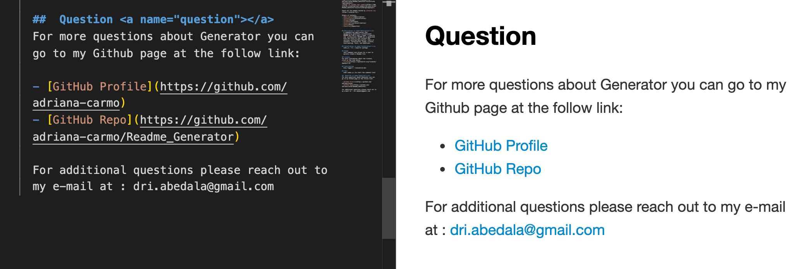

<h1 align="center">Welcome to readme_generator 👋</h1>
<p>
  
  <a href="https://github.com/adriana-carmo/ReadMe_Generator#readme" target="_blank">
    
  </a>
  <a href="https://github.com/adriana-carmo/ReadMe_Generator/graphs/commit-activity" target="_blank">
    
  </a>
  <a href="https://github.com/adriana-carmo/ReadMe_Generator/blob/master/LICENSE" target="_blank">
    
  </a>
</p>

### 🏠 [Homepage](https://github.com/adriana-carmo/ReadMe_Generator#readme)

> creating an open source project on GitHub, it is important to have a quality README with information about the app--what is the app for, how to use the app, how to install it, how to report issues, and how to make contributions so that other developers are more likely to use and contribute to the success of the project.





## Install

```sh
npm install
npm install inquirer
```

## Run tests

```sh
node index.js
```

## Author

👤 **Adriana**

* Github: [@adriana-carmo](https://github.com/adriana-carmo)

## 🤝 Contributing

Contributions, issues and feature requests are welcome!<br />
Feel free to check [issues page](https://github.com/adriana-carmo/ReadMe_Generator/issues). 

## Video


## Show your support

Give a ⭐️ if this project helped you!

## 📝 License

Copyright © 2020 [Adriana](https://github.com/adriana-carmo).<br />
This project is [ISC](https://github.com/adriana-carmo/ReadMe_Generator) licensed.

***
_This README was generated with ❤️ by [readme-md-generator](https://github.com/kefranabg/readme-md-generator)_